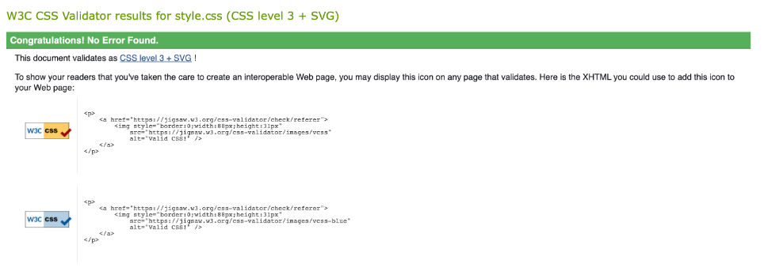
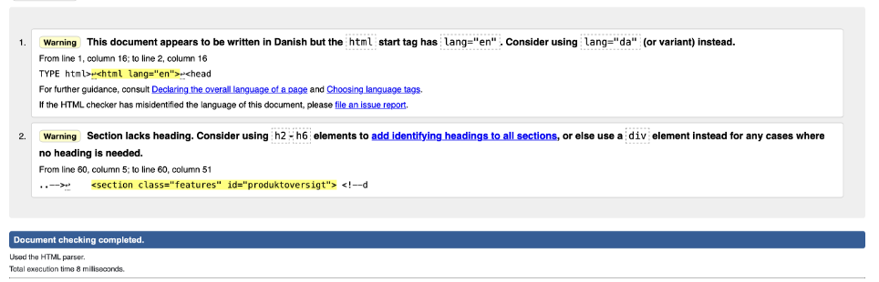

# LUMINA One Eksamensprojekt
## Kort beskrivelse af projektet
I mit eksamensprojekt har jeg videreudviklet og optimeret det første projekt fra semestret, som bestod af en landingpage til den fiktive case LUMINA One. Projektet tager udgangspunkt i en given persona, hvis behov, mål og adfærd har dannet grundlag for design- og kommunikationsvalgene. Formålet med optimeringen har været at forbedre brugeroplevelsen, styrke den visuelle kommunikation og skabe en mere effektiv landingpage, der i højere grad understøtter målgruppens behov og virksomhedens mål.

Projektet arbejder primært med kvalitative data. Datagrundlaget består af den udleverede persona, teori om brugeroplevelse, webkommunikation og designprincipper samt analyser af landingpagens indhold og struktur. Disse data er anvendt til at identificere forbedringsmuligheder og udvikle en optimeret løsning, der bedre imødekommer målgruppens behov.

## Fil- og mappestruktur
Projektet er organiseret i en overskuelig mappestruktur, hvor filer er opdelt efter deres funktion. CSS-filen er i mappen css, som indeholder projektets styling (style.css). JavaScript-koden er placeret i mappen js i filen script.js, som håndterer interaktive funktioner på siden.

Alle billeder og grafiske elementer er samlet i mappen img, der indeholder produktbilleder, livsstilsbilleder, logoer og baggrundsbilleder. Derudover findes en undermappe (icons), som indeholder de ikoner, der anvendes på hjemmesiden.

Projektets hovedside er placeret i filen index.html, som fungerer som indgangspunkt til landingpagen og forbinder HTML-strukturen med CSS- og JavaScript-filerne. Derudover indeholder projektet en README.md-fil. 

Denne struktur, hvor indhold (HTML), præsentation (CSS), funktionalitet (JavaScript) og medier (billeder og ikoner) er adskilt i separate mapper gør at projektet er mere overskueligt, vedligeholdelsesvenligt og lettere at videreudvikle.

## Validering af CSS
Jeg har brugt denne hjemmeside til at validere min css som kan ses nedenfor er godkendt: https://jigsaw.w3.org/css-validator/validator.html.en



## Validering af html
Jeg har brugt denne hjemmeside til at validere min html som kan ses nedenfor er godkendt: https://validator.w3.org



## JavaScript datastruktur og kode

I projektet arbejder jeg med produktdata i JavaScript ved hjælp af et objekt kaldet product. Objektet indeholder forskellige typer data, som bruges til at vise information om produktet LUMINA One på landingpagen.

Objektet indeholder properties som name, description og price, der gemmer produktets navn, beskrivelse og pris. Derudover indeholder objektet to arrays: images og variants.

Arrayet images består af tekst (strings), som indeholder filstier til produktets billeder. Disse bruges til at vise de forskellige produktbilleder på websitet.

Arrayet variants indeholder objekter, hvor hvert objekt repræsenterer en produktvariant. Hvert objekt har en property kaldet name, som angiver farven på den pågældende variant, eksempelvis "Dusty Rose" eller "Sage Green".

Denne datastruktur passer godt til projektet, fordi den samler alle relevante oplysninger om produktet ét sted. Ved at bruge arrays kan der nemt tilføjes flere billeder eller produktvarianter uden at ændre den øvrige kode. Samtidig gør objekter det muligt at organisere data på en logisk og overskuelig måde, hvilket gør koden mere vedligeholdelsesvenlig og skalerbar.

### Koden kan ses her nedenunder:

```javascript
const product = {
    name: 'LUMINA One',
    description: 'LUMINA One er en bærbar højttaler skabt til sociale øjeblikke. Den kombinerer kraftfuld lyd med et nordisk, æstetisk design, der passer naturligt ind i både hjemmet og udendørslivet.',
    price: " 1499.00",
     // Et array med stier til produktbillederne.
    images: [
        'img/dusty-rose-1.png',
        'img/sage-green-1.png',
        'img/moonlight-white-1.png',
        'img/lavender-mist-1.png'
    ],
     // Et array med produktets forskellige varianter/farver.
    variants: [
        {
            name: 'Dusty Rose'
        },
        {
            name: 'Sage Green'
        },
        {
            name: 'Moonlight White'
        },
        {
            name: 'Lavender Mist'
        }
    ]
};
```
### Hvad gør koden?
JavaScript bruger dataene fra product-objektet til dynamisk at opdatere HTML-elementer på siden. Det betyder, at produktnavn, beskrivelse, pris, billeder og farvevalg kan indsættes eller ændres automatisk uden at redigere HTML-koden manuelt.

Koden er vigtig, fordi den gør landingpagen dynamisk og lettere at vedligeholde. Alle produktdata er samlet ét sted, hvilket gør det nemt at opdatere produktinformation, tilføje nye billeder eller oprette flere varianter. Samtidig forbedrer det brugeroplevelsen ved at gøre siden mere interaktiv og fleksibel.

